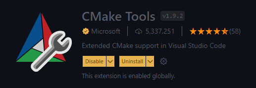
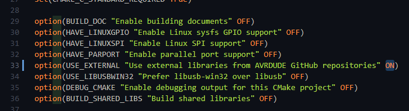
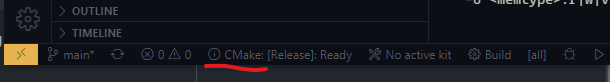
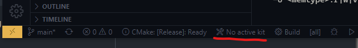
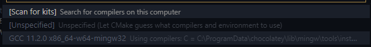
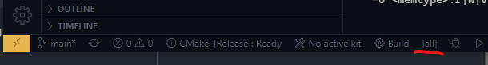
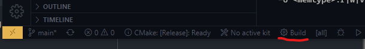
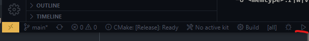
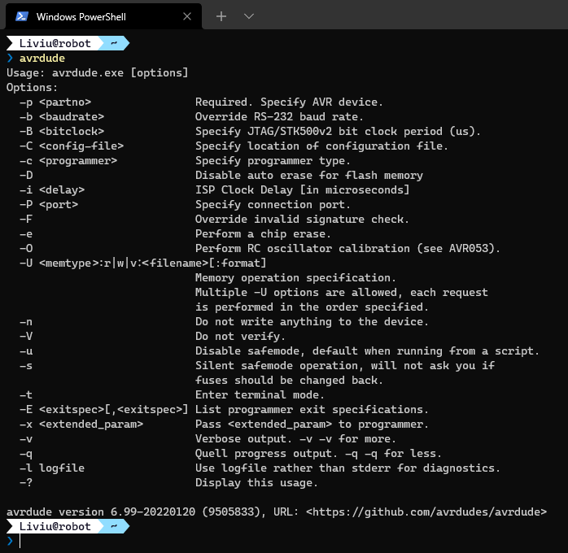

This tutorial describes how to build avrdude from source. The software needed to carry this out is installed using chocolatey, which is a package manager for Windows. This simplifies the process, but it is not a necessary requirement. You can also go to the respective website of each tool and download it from there (for example, [vscode](https://code.visualstudio.com/))

1. Install the following tools:
   1. **Optional:** if you are using chocolatey, you can run the following command: *choco install git vscode mingw cmake winflexbison -y*    This will install all the tools at once. If you're not using chocolatey, you have to manually install the tools listed in steps 2-6.
   2. [Git](https://git-scm.com/downloads)
   3. [vscode](https://code.visualstudio.com/)
   4. [mingw](https://www.mingw-w64.org/downloads/)
   5. [cmake](https://cmake.org/download/)
   6. [win flex-bison](https://sourceforge.net/projects/winflexbison/)
2. Open vscode and install the *CMake Tools* extension  
3. Go to the [avrdude repository](https://github.com/avrdudes/avrdude/) on github and clone it to a directory on your computer 
4. Open the repository with vscode
5. Open src/CMakeLists.txt and set the "USE_EXTERNAL" option to ON  
6. On the lower left part of vscode, the CMake project can be configured. Click on the indicated icon and select *Release*  
7. Click on the indicated icon and select the GCC compiler you just installed (mingw). If it is not listed, select *[scan for kits]* and then repeat.  I am using this gcc version: 
8. Click on this icon and select *all*  
9. Click on this icon.  This will create the build environment.
10. Finallly, click on this icon.  This will create the executable which is located in ./src/build/
11. Add this location to the PATH variable
12. Check if it works by opening a command prompt and typing *avrdude*. Example of valid output: 