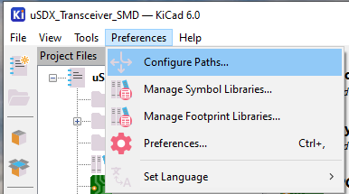
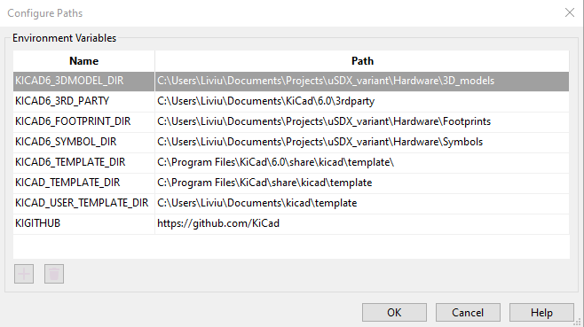
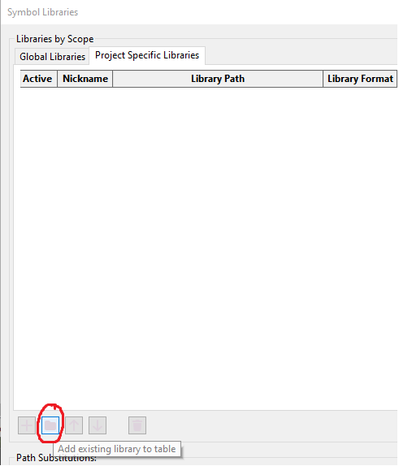
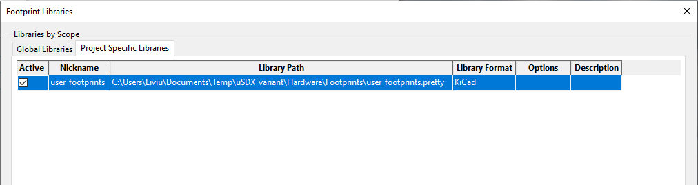

After cloning this project, you must configure the project paths. This must be done 
for both uSDX_BPF and uSDX_Transceiver_SMD projects.

1. Open a *.pro file
2. Go to Preferences -> Configure paths

3. Here you will need to set the paths for:
- KICAD6_3DMODEL_DIR -> ./Hardware/3D_models
- KICAD6_FOOTPRINT_DIR -> ./Hardware/Footprints
- KICAD6_SYMBOL_DIR -> ./Hardware/Symbols

4. Go to Preferences -> Manage symbol libraries
5. If the libraries under the Global Libraries tab are active, press Ctrl+A to select all of them and then press Space to untick the "Active" property for all of them.
6. Go to the Project Specific Libraries tab and press the folder icon

7. Go the ./Hardware/Symbols/ and select the appropriate *.kicad_sym file for the project you selected

8. Go to Preferences -> Manage footprint libraries and repeat steps 5 and 6.
9. Go to ./hardware/Footprints/user_footprints.pretty and then click "Select Folder"

10. Repeat these steps for the other project
11. You're all set :-)
